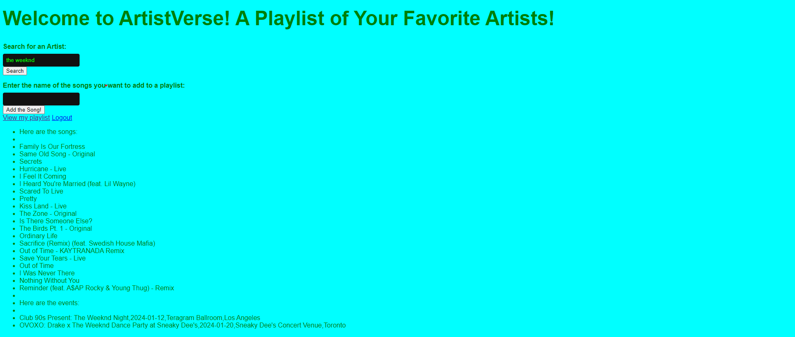

# ArtistVerse!

Welcome aboard to ArtistVerse! A simple Full Stack Web Application that can generate your favorite songs and events based on the music artist that you've searched up. When you first launch the application on the web, it will first prompt you to the registration page. If we don't have your login credentials stored locally in our SQL database, you will first need to register an account first. However, if your login credential is already stored in our database, you can log in locally to access our mainpage. We also provided another option for 3rd party Oauth login through Spotify so we can verify your login with your Spotify account and log you in to access the mainpage. After you have successfully login, there will be a search bar for you to search youre favorite music artist. It may take a while depending how many songs it generated when the user types in a artist making a call to the Spotify API and Ticketmaster API. After a few seconds, we will generate a list of songs by that artist you just typed in and the upcoming events the artist may have. It may not generate any events if there are none upcoming. You will also be provided with another input bar for you to add your favorite song by that artist to your playlist. You can drag to copy and paste the song onto the input bar and press Add so the song is added to your playlist. After that, you can press View my playlist and it will redirect you to another page with the list of songs that you just added. This is the overall functionality of our app. Once again, we are please to welcome you to ArtistVerse! A website that will list the songs of your artist so you won't have to think off the top of your head!

# Techstack: 
### Frontend: HTML, CSS, JavaScript
### Backend: Python(Flask), SQL(MySQL)
### APIs: Spotify, Ticketmaster

# Below is a screenshot of what the results will show with an artist searched:

# Here is a screenshot of a playlist for all the songs that you added:

